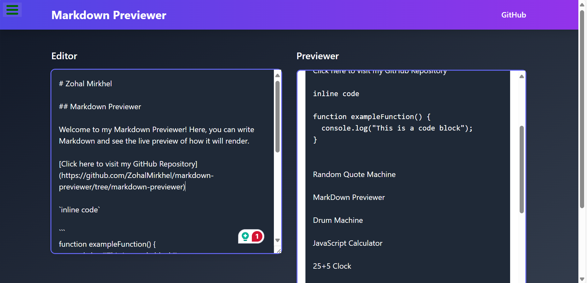

# Markdown Previewer

## Overview

The Markdown Previewer is a React application that allows users to write Markdown content and see a live preview of their formatted text. This project utilizes Tailwind CSS for styling and provides a seamless experience for users to visualize their Markdown content in real-time.

## Features

- **Live Preview**: As you type Markdown in the editor, the preview updates instantly.
- **Markdown Syntax Support**: Supports common Markdown syntax including headers, lists, links, and emphasis.
- **Responsive Design**: The interface is styled using Tailwind CSS for a clean and responsive layout.


## Getting Started

### Prerequisites

- [Node.js](https://nodejs.org/) (version 14 or later)
- [npm](https://www.npmjs.com/) or [Yarn](https://classic.yarnpkg.com/en/) (package managers)


## Live Demo


You can view a live demo of the project [here](https://quote-machine--quote-machine-p.netlify.app/)


## Installation
To run this project locally, follow these steps :

1. **Clone the Repository**

   ```bash
   git clone git@github.com:ZohalMirkhel/markdown-previewer.git
   ```

2. **Navigate to the project directory**:
   ```bash
   cd markdown previewer
   ```

3. **Install the Required Dependencies**:
   ```bash
   npm install
   ```

4. **Run the Project:**:
   ```bash
   npm start
   ```

## Usage

1. **Write Markdown:** Enter your Markdown content in the editor on the left side of the screen.
2. **View Preview:** See the live preview of your Markdown on the right side of the screen.

## Adjusting Styles

You can adjust the styling of the components by modifying the Tailwind CSS classes or adding custom styles in the App.js file.

## Contributing

If you'd like to contribute to this project, please fork the repository, make your changes, and submit a pull request. We welcome all contributions!

## Author

For any questions, feedback, or support, please contact me at:
- Email: [zohalmirkhel@gmail.com](mailto:zohalmirkhel@gmail.com)
- GitHub: [Zohal Mirkhel](https://github.com/ZohalMirkhel)
- LinkedIn: [Zohal Mirkhel](https://www.linkedin.com/in/zohal-mirkhel-840a7530a/)